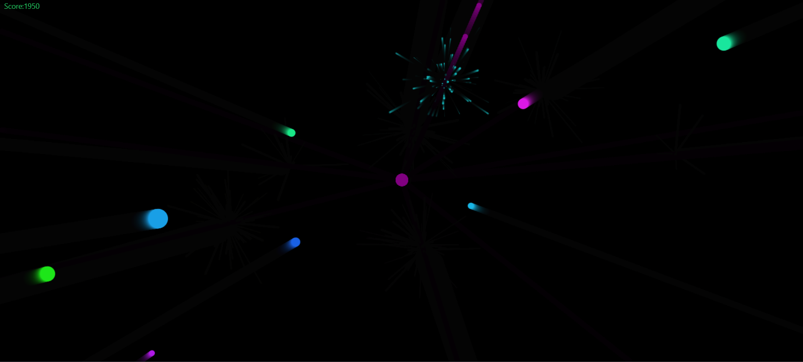
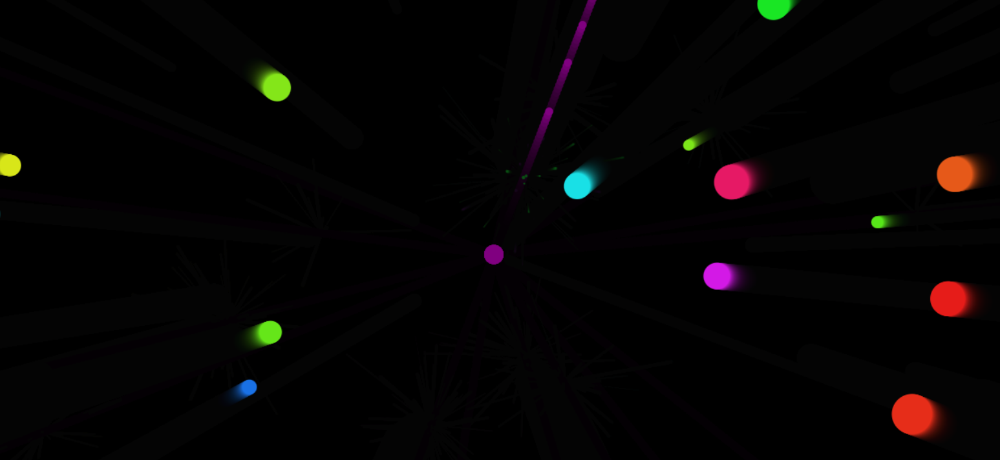

# Projectile Pun

A little canvas shooter with color-burst explosions and high-score tracking.

## How to run

1. Open `index.html` in your browser.  
2. Click **Start Game**.  
3. Click anywhere to shoot projectiles at oncoming enemies.  
4. Your high score is saved in `localStorage`.

## Gameplay

The game features colorful enemies approaching from all sides. Shoot them with projectiles to earn points and create beautiful particle explosions.

## Features

- Responsive full-screen canvas  
- Cool fading particle bursts  
- Score and all-time high score  
- Restart button without page reload  
- Colorful visual effects
- Progressively increasing difficulty

## Future improvements

- Mobile touch controls  
- Power-up pickups  
- Sound effects  

Enjoy!